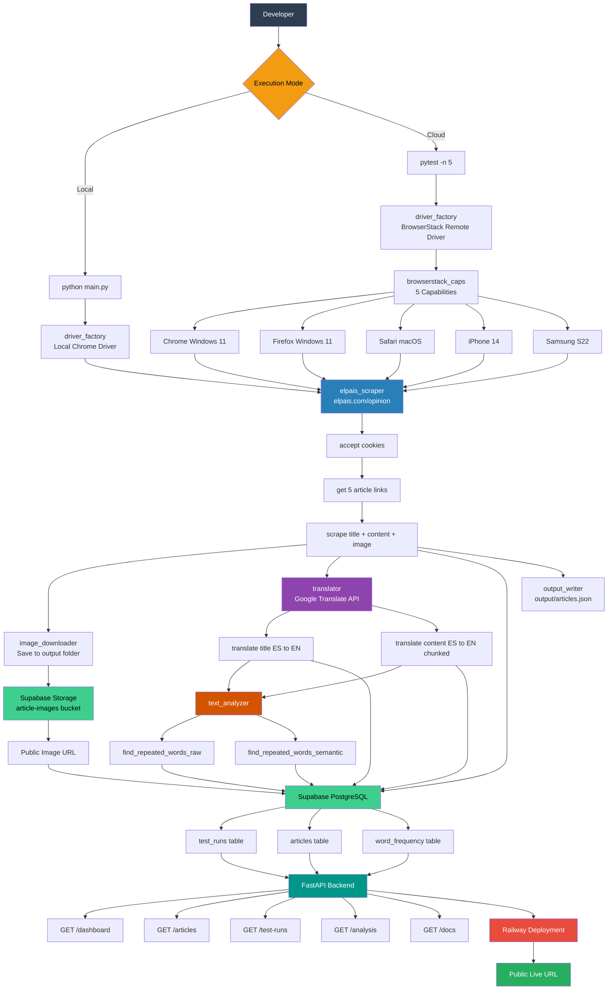
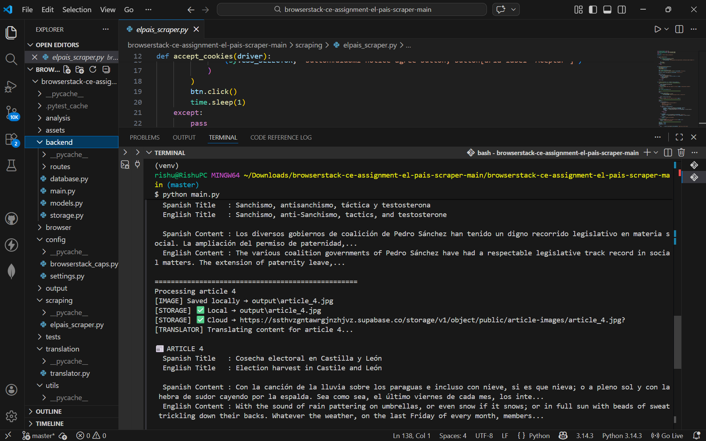
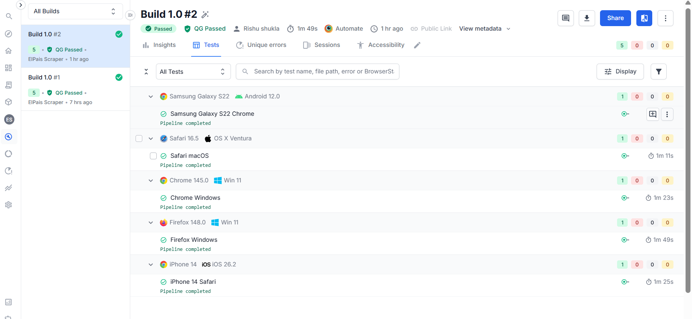
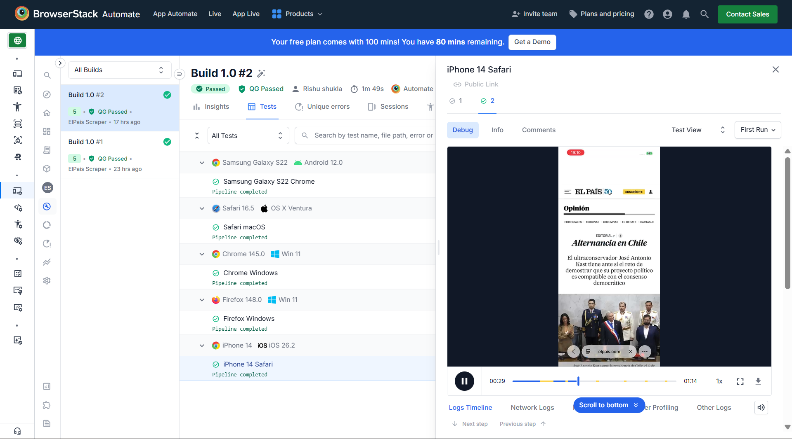
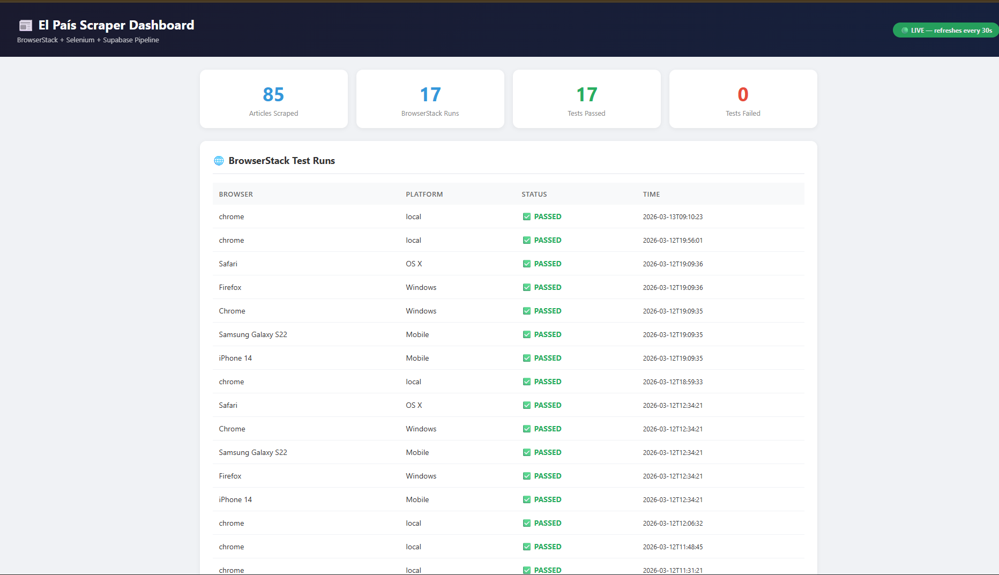
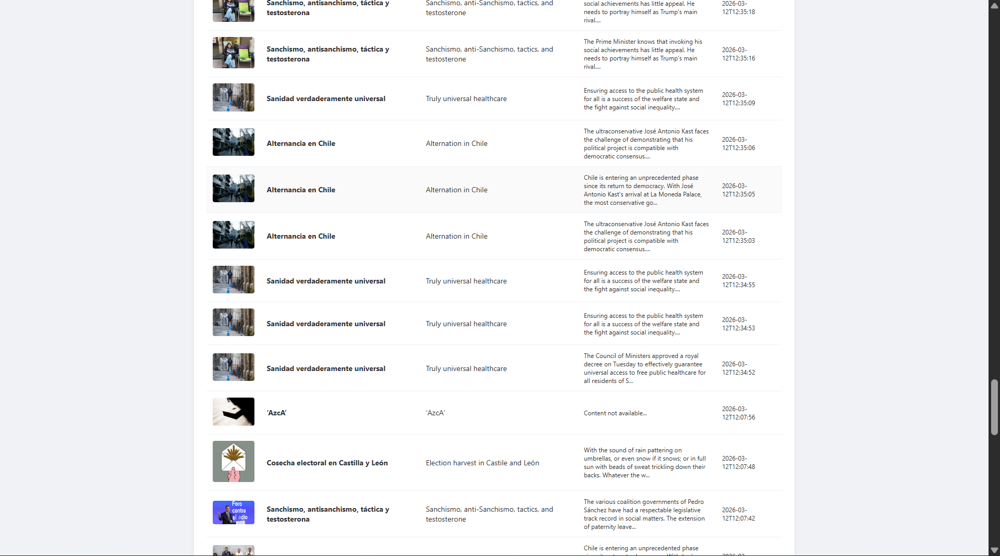

# BrowserStack-Customer_Engineer

## Selenium Technical Assignment


## Live Demo
- **Dashboard**: https://web-production-08130.up.railway.app/dashboard
- **API Docs**: https://web-production-08130.up.railway.app/docs
- **Articles API**: https://web-production-08130.up.railway.app/articles
- **Test Runs API**: https://web-production-08130.up.railway.app/test-runs

---

## Overview

This project is a full-stack Selenium-based automation pipeline for web scraping, API integration, text processing, cross-browser testing, and cloud persistence. It fulfills the technical assignment by automating interactions with El Pais, a leading Spanish news outlet and goes significantly beyond requirements with a live backend, database persistence, cloud image storage, and a real-time dashboard.

### Key Capabilities

- **Navigation and Scraping**: Accesses El Pais, ensures Spanish language display, navigates to the Opinion section, and extracts the first five articles including titles, full content, and cover images.
- **Translation**: Translates article titles AND full content from Spanish to English using Google Translate API.
- **Text Analysis**: Performs frequency analysis on translated titles, identifying words repeated more than twice, with semantic enhancements including stopword removal.
- **Image Handling**: Downloads cover images locally AND uploads them to Supabase Storage for cloud persistence with public URLs.
- **Database Persistence**: All scraped articles, translations, BrowserStack run results, and word frequency data are saved to Supabase PostgreSQL.
- **Live REST API**: FastAPI backend exposes queryable endpoints for all data.
- **Live Dashboard**: Real-time web dashboard showing articles, BrowserStack results, and word frequency chart that auto-refreshes every 30 seconds.
- **Cross-Browser Testing**: Runs locally for development and in parallel on BrowserStack across 5 desktop and mobile browsers.

---

## Architecture Diagram




---

## Tech Stack

| Layer | Technology |
|---|---|
| Language | Python 3.11 |
| Automation | Selenium WebDriver |
| Testing | Pytest, pytest-xdist parallel |
| Cloud Testing | BrowserStack Automate |
| Translation | Google Translate API |
| Backend API | FastAPI + Uvicorn |
| Database | Supabase PostgreSQL |
| Image Storage | Supabase Storage |
| Deployment | Railway |
| HTTP Client | Requests |
| Configuration | Python-dotenv |
| Text Processing | Collections Counter, Regular Expressions |

---

## Project Structure

```
BrowserStack-Assignment/
├── main.py                      # Local execution entry point
├── requirements.txt             # Python dependencies
├── .env                         # Environment variables (not committed)
├── .gitignore                   # Git exclusions
├── conftest.py                  # Pytest path configuration
├── Procfile                     # Railway deployment config
├── supabase_schema.sql          # Database setup script
│
├── analysis/
│   └── text_analyzer.py         # Word frequency logic raw and semantic
│
├── backend/                     # FastAPI backend + Supabase integration
│   ├── __init__.py
│   ├── main.py                  # FastAPI app + live dashboard
│   ├── database.py              # Supabase client + all DB operations
│   ├── storage.py               # Supabase Storage image upload
│   ├── models.py                # Pydantic models
│   └── routes/
│       ├── __init__.py
│       ├── articles.py          # GET /articles endpoints
│       ├── test_runs.py         # GET /test-runs endpoints
│       └── analysis.py          # GET /analysis endpoints
│
├── browser/
│   └── driver_factory.py        # Local + BrowserStack driver setup
│
├── config/
│   ├── browserstack_caps.py     # 5 browser configurations
│   └── settings.py              # All environment variables
│
├── scraping/
│   └── elpais_scraper.py        # El Pais scraping logic
│
├── translation/
│   └── translator.py            # Google Translate API integration
│
├── utils/
│   ├── image_downloader.py      # Local image download
│   └── output_writer.py         # JSON output writer
│
├── tests/
│   └── test_browserstack.py     # 5-thread parallel BrowserStack runner
│
├── output/                      # Local images + JSON results
└── assets/                      # README screenshots
```

---

## Assignment Requirements Covered

### 1. Web Scraping
- Navigates to El Pais and verifies Spanish content via language headers
- Accesses Opinion section at https://elpais.com/opinion/
- Extracts first 5 articles with titles, full content, and cover images in Spanish
- Downloads and saves cover images locally to output folder
- Handles dynamic JS loading with explicit Selenium waits

### 2. Translation
- Translates Spanish titles to English using Google Translate API
- Translates Spanish content to English (beyond requirement)
- Handles long content by splitting into chunks respecting the Google API 5000 char limit
- Saves both ES and EN versions to Supabase database

### 3. Text Analysis
- **Raw Frequency**: Scans translated headers for words repeated more than twice
- **Semantic Enhancement**: Removes stopwords for cleaner insights
- Results saved to Supabase word_frequency table

### 4. Cross-Browser Testing — 5 Parallel Threads

| # | Type | Browser | OS / Device |
|---|---|---|---|
| 1 | Desktop | Chrome | Windows 11 |
| 2 | Desktop | Firefox | Windows 11 |
| 3 | Desktop | Safari | macOS Ventura |
| 4 | Mobile | Safari | iPhone 14 |
| 5 | Mobile | Chrome | Samsung Galaxy S22 |

---

## What This Project Adds Beyond Requirements

| Feature | Details |
|---|---|
| Supabase Database | All runs, articles, translations, word frequency saved permanently |
| Supabase Storage | Cover images uploaded to cloud with public URLs |
| Content Translation | Full article content translated ES to EN not just titles |
| FastAPI Backend | Live REST API with Swagger docs |
| Live Dashboard | Visual dashboard with stats, articles, images, chart |
| Auto-refresh | Dashboard refreshes every 30 seconds automatically |
| Word Frequency Chart | Chart.js bar chart of repeated words |
| Railway Deployment | Entire backend deployed and publicly accessible |

---

## Setup Instructions

### 1. Clone the Repository

```bash
git clone https://github.com/Rishushukla157/Browserstack.git
cd BrowserStack-Assignment
```

### 2. Create Virtual Environment with Python 3.11

```bash
py -3.11 -m venv venv
source venv/Scripts/activate
```

### 3. Install Dependencies

```bash
pip install -r requirements.txt
```

### 4. Set Up Supabase

1. Create a free project at supabase.com
2. Go to SQL Editor, paste supabase_schema.sql and click Run
3. Go to Storage, create bucket named article-images and set to Public
4. Go to SQL Editor and run:

```sql
ALTER TABLE test_runs      DISABLE ROW LEVEL SECURITY;
ALTER TABLE articles       DISABLE ROW LEVEL SECURITY;
ALTER TABLE word_frequency DISABLE ROW LEVEL SECURITY;
ALTER TABLE storage.objects DISABLE ROW LEVEL SECURITY;
```

### 5. Configure Environment

Create a .env file in the project root:

```env
BROWSERSTACK_USERNAME=your_browserstack_username
BROWSERSTACK_ACCESS_KEY=your_browserstack_access_key
TRANSLATE_API_KEY=your_google_translate_api_key
SUPABASE_URL=https://your-project-id.supabase.co
SUPABASE_KEY=your_supabase_anon_key
```

---

## Usage

### Run Locally

```bash
python main.py
```

### Run FastAPI Dashboard Locally

```bash
python -m uvicorn backend.main:app --reload --port 8000
```

Open http://localhost:8000/dashboard

### Run on BrowserStack with 5 parallel threads

```bash
python -m pytest tests/test_browserstack.py -n 5 -v
```

---

## API Endpoints

| Method | Endpoint | Description |
|---|---|---|
| GET | / | Health check + DB status |
| GET | /dashboard | Live visual dashboard |
| GET | /articles | All scraped articles |
| GET | /articles/{id} | Single article |
| GET | /test-runs | All BrowserStack runs |
| GET | /test-runs/{id} | Single run with articles |
| GET | /analysis/{run_id} | Word frequency for a run |
| GET | /docs | Swagger UI |

---

## Output

### Console
- Spanish article titles and content
- English translated titles and content
- Raw repeated words more than twice
- Semantic repeated words with stopwords removed

### Local Files
- output/article_1.jpg to article_5.jpg — cover images
- output/articles.json — full structured results

### Supabase Database
- test_runs — every BrowserStack and local run
- articles — all scraped articles with ES and EN titles and content
- word_frequency — repeated words per run

### Supabase Storage
- article-images/article_1.jpg to article_5.jpg — cloud hosted images

---

## Results

### Local Execution



### BrowserStack Dashboard



**Session Links** : [View BrowserStack Build](https://automate.browserstack.com/projects/ElPais+Scraper/builds/Build/2?tab=tests&testListView=spec)


Session videos, logs, and network traces are available
### Dashboard



---

## Requirements

```
pytest==9.0.2
pytest-xdist==3.8.0
python-dotenv==1.2.1
requests==2.32.5
selenium==4.40.0
webdriver-manager==4.0.2
fastapi==0.110.0
uvicorn[standard]==0.27.1
pydantic==2.6.1
supabase==2.3.4
httpx==0.24.1
gotrue==1.3.0
storage3==0.5.3
postgrest==0.10.8
realtime==1.0.0
```

---

## Design Decisions

- **Separation of Execution Modes**: Local runs via main.py for development and cloud tests via pytest for cross-browser validation
- **Modular Architecture**: Dedicated modules for scraping, translation, analysis, and storage that are easy to extend
- **Full Persistence**: Every run saved to Supabase so nothing is lost between sessions
- **Dual Storage**: Images saved both locally and to Supabase Storage for redundancy
- **Chunked Translation**: Long content split into 4500 char chunks to stay within Google API limits
- **Explicit Wait Strategy**: WebDriverWait over time.sleep for reliability
- **Fault Tolerance**: Every module wrapped in try/except so one failure never stops the pipeline
- **Live Dashboard**: FastAPI serves a real-time HTML dashboard readable by anyone with the URL

---

*Author Rishu Shulkla*
