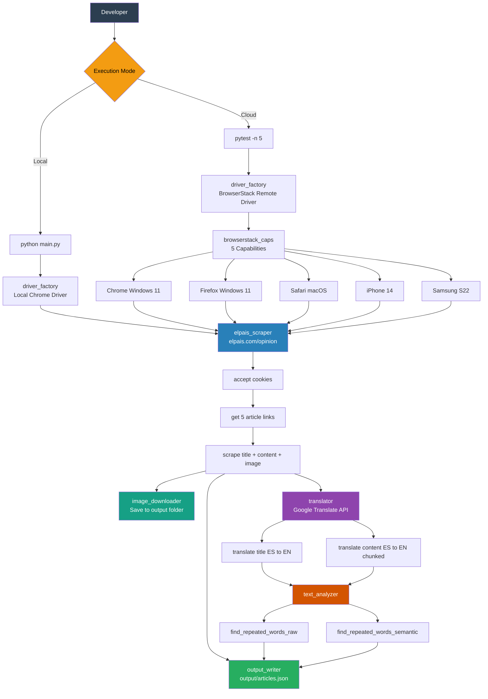
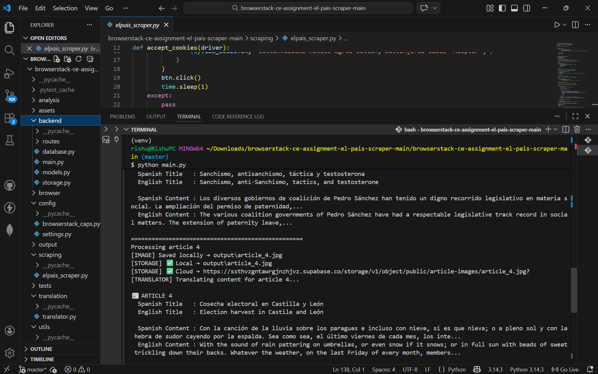
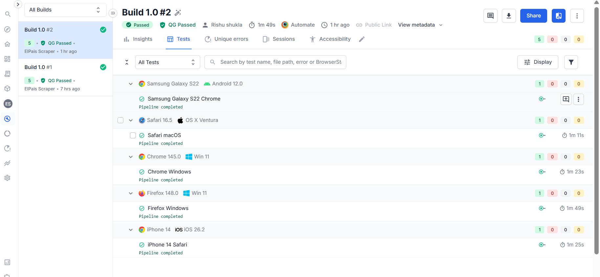
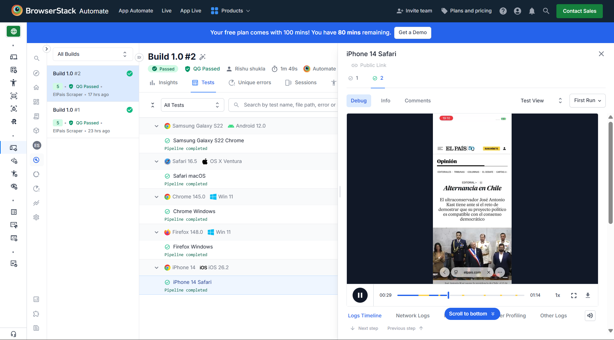

# BrowserStack-Customer_Engineer

## Selenium Technical Assignment


---

## Overview

This project is a Selenium-based automation pipeline for web scraping, translation, text analysis, and cross-browser testing. It automates interactions with El Pais, a leading Spanish news outlet, extracting articles, translating them to English, and running the full pipeline across 5 browsers in parallel on BrowserStack.

### Key Capabilities

- **Navigation and Scraping**: Accesses El Pais, ensures Spanish language display, navigates to the Opinion section, and extracts the first five articles including titles, full content, and cover images.
- **Translation**: Translates article titles AND full content from Spanish to English using Google Translate API.
- **Text Analysis**: Performs frequency analysis on translated titles, identifying words repeated more than twice, with semantic enhancements including stopword removal.
- **Image Handling**: Downloads cover images locally to the output folder.
- **Local Output**: All scraped articles and results are saved as structured JSON locally.
- **Cross-Browser Testing**: Runs locally for development and in parallel on BrowserStack across 5 desktop and mobile browsers.

---

## Architecture Diagram


```mermaid
flowchart TD
    A[Developer] --> B{Execution Mode}

    B -->|Local| C[python main.py]
    B -->|Cloud| D[pytest -n 5]

    C --> E[driver_factory\nLocal Chrome Driver]
    D --> F[driver_factory\nBrowserStack Remote Driver]

    F --> G[browserstack_caps\n5 Capabilities]
    G --> G1[Chrome Windows 11]
    G --> G2[Firefox Windows 11]
    G --> G3[Safari macOS]
    G --> G4[iPhone 14]
    G --> G5[Samsung S22]

    E --> H[elpais_scraper\nelpais.com/opinion]
    G1 --> H
    G2 --> H
    G3 --> H
    G4 --> H
    G5 --> H

    H --> H1[accept cookies]
    H1 --> H2[get 5 article links]
    H2 --> H3[scrape title + content + image]

    H3 --> I[image_downloader\nSave to output folder]
    H3 --> J[translator\nGoogle Translate API]

    J --> J1[translate title ES to EN]
    J --> J2[translate content ES to EN chunked]

    J1 --> K[text_analyzer]
    J2 --> K

    K --> K1[find_repeated_words_raw]
    K --> K2[find_repeated_words_semantic]

    H3 --> N[output_writer\noutput/articles.json]
    K1 --> N
    K2 --> N

    style A fill:#2c3e50,color:#fff
    style N fill:#27ae60,color:#fff
    style H fill:#2980b9,color:#fff
    style J fill:#8e44ad,color:#fff
    style K fill:#d35400,color:#fff
    style B fill:#f39c12,color:#000
    style I fill:#16a085,color:#fff
```

---

## Tech Stack

| Layer | Technology |
|---|---|
| Language | Python 3.11 |
| Automation | Selenium WebDriver |
| Testing | Pytest, pytest-xdist parallel |
| Cloud Testing | BrowserStack Automate |
| Translation | Google Translate API |
| HTTP Client | Requests |
| Configuration | Python-dotenv |
| Text Processing | NLTK, Collections Counter |

---

## Project Structure

```
BrowserStack-Assignment/
├── main.py                      # Local execution entry point
├── requirements.txt             # Python dependencies
├── .env                         # Environment variables (not committed)
├── .gitignore                   # Git exclusions
├── conftest.py                  # Pytest path configuration
│
├── analysis/
│   └── text_analyzer.py         # Word frequency logic raw and semantic
│
├── browser/
│   └── driver_factory.py        # Local + BrowserStack driver setup
│
├── config/
│   ├── browserstack_caps.py     # 5 browser configurations
│   └── settings.py              # All environment variables
│
├── scraping/
│   └── elpais_scraper.py        # El Pais scraping logic
│
├── translation/
│   └── translator.py            # Google Translate API integration
│
├── utils/
│   ├── image_downloader.py      # Local image download
│   └── output_writer.py         # JSON output writer
│
├── tests/
│   └── test_browserstack.py     # 5-thread parallel BrowserStack runner
│
└── output/                      # Local images + JSON results
```

---

## Assignment Requirements Covered

### 1. Web Scraping
- Navigates to El Pais and verifies Spanish content via language headers
- Accesses Opinion section at https://elpais.com/opinion/
- Extracts first 5 articles with titles, full content, and cover images in Spanish
- Downloads and saves cover images locally to output folder
- Handles dynamic JS loading with explicit Selenium waits

### 2. Translation
- Translates Spanish titles to English using Google Translate API
- Translates Spanish content to English (beyond requirement)
- Handles long content by splitting into chunks respecting the Google API 5000 char limit

### 3. Text Analysis
- **Raw Frequency**: Scans translated headers for words repeated more than twice
- **Semantic Enhancement**: Removes stopwords using NLTK for cleaner insights
- Results printed to console and saved to output/articles.json

### 4. Cross-Browser Testing — 5 Parallel Threads

| # | Type | Browser | OS / Device |
|---|---|---|---|
| 1 | Desktop | Chrome | Windows 11 |
| 2 | Desktop | Firefox | Windows 11 |
| 3 | Desktop | Safari | macOS Ventura |
| 4 | Mobile | Safari | iPhone 14 |
| 5 | Mobile | Chrome | Samsung Galaxy S22 |

---

## Setup Instructions

### 1. Clone the Repository

```bash
git clone https://github.com/Rishushukla157/Browserstack.git
cd BrowserStack-Assignment
```

### 2. Create Virtual Environment with Python 3.11

```bash
py -3.11 -m venv venv
source venv/Scripts/activate
```

### 3. Install Dependencies

```bash
pip install -r requirements.txt
```

### 4. Configure Environment

Create a .env file in the project root:

```env
BROWSERSTACK_USERNAME=your_browserstack_username
BROWSERSTACK_ACCESS_KEY=your_browserstack_access_key
TRANSLATE_API_KEY=your_google_translate_api_key
```

---

## Usage

### Run Locally

```bash
python main.py
```

### Run on BrowserStack with 5 parallel threads

```bash
python -m pytest tests/test_browserstack.py -n 5 -v
```

---

## Output

### Console
- Spanish article titles and content
- English translated titles and content
- Raw repeated words more than twice
- Semantic repeated words with stopwords removed

### Local Files
- output/article_1.jpg to article_5.jpg — cover images
- output/articles.json — full structured results

---

## Results

### Local Execution


### BrowserStack Dashboard



**Session Links** : [View BrowserStack Build](https://automate.browserstack.com/projects/ElPais+Scraper/builds/Build/2?tab=tests&testListView=spec&public_token=3e43cfbd4fcc4d3580e56a811d3832908dbacfa1a8234184faa156830d0e3ee3)

Session videos, logs, and network traces are available

---

## Requirements

```
pytest==9.0.2
pytest-xdist==3.8.0
python-dotenv==1.2.1
requests==2.32.5
selenium==4.40.0
webdriver-manager==4.0.2
nltk==3.8.1
```

---

## Design Decisions

- **Separation of Execution Modes**: Local runs via main.py for development and cloud tests via pytest for cross-browser validation
- **Modular Architecture**: Dedicated modules for scraping, translation, analysis, and storage that are easy to extend
- **Chunked Translation**: Long content split into 4500 char chunks to stay within Google API limits
- **Explicit Wait Strategy**: WebDriverWait over time.sleep for reliability
- **Fault Tolerance**: Every module wrapped in try/except so one failure never stops the pipeline
- **Local Persistence**: All results written to output/articles.json and images saved to output/ folder

---

*Author Rishu Shulkla*